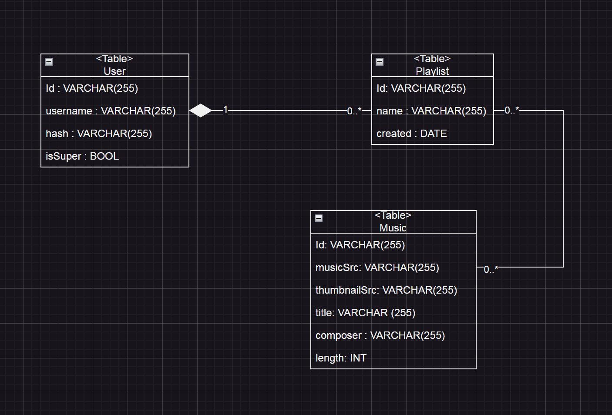

# LernPeriode-08
In diesem Projekt werde ich mittels neuer technologien eine Webapp bauen. Für dies werde ich ASP.NET (backend) zusammen mit EntityFramework (db) und svelte (frontend) eine Webapp bauen. Für dies werde ich eine Musikapp (musikplayer) machen. Die tatsächliche musik/assets wird in einem S23-bucket gelagert wobei mein Backend das management der unterschiedlichen Titel sowie das einfügen von neuen Titeln handelt (playlists). Auch handelt es die Authorisierung die nur mir und wenigen Bekannten die verwendung dieser app erlaubt. Das frontend in Svelte erlaubt Titel zu selektieren und nach belieben abzuspielen. Zudem hat es einen weg neue Musik via einem YouTube link hochzuladen. Falls ich noch zeit/lust habe werde ich diese WebApp als PWA fürs Handy verfügbar machen so dass es 100% als musikapp läuft. Die datenbank (EntityFramework) handelt das logging der unterschiedlichen ressourcen. Denn obwohl die tatsächlichen audio/bildfiles nicht lokal bei mir gelagert werden, stellt EntityFramework die ordnung der Files bereit. 

Je nach dem werde ich übrige zeit auf die entwicklung eines anderen Backends setzen.

Für Svelte verwende ich das folgende Tutorial: https://svelte.dev/tutorial/svelte/welcome-to-svelte
Und für ASP.NET sowie EF verwende ich generelles googeling und recherche

## 20.2.26
- [X] Hello world implementieren
- [X] Hello world bereitmachen zur ausführung mit Docker/DockerCompose

Krank.

## 17.2.26
- [X] Planen der HTTP endpunkte
- [X] Planen des Datenmodelles
- [ ] Implementierung von Controllern und rohimplementierung
- [ ] Implementierung von Auth mit JWT

Ich konnte heute das  Datenmodell sowie weitere konzepte (Auth) sehr gut Ausplanen. Vielleicht werde ich doch ein wenig mehr zeit fürs Backend brauchen als erwartet. Am idealsten könnte ich die Authentifizierung und Autorisierung bis zum nächsten mal umsetzen.
## 6.3.26
- [X] Umsetzung Login
- [X] Umsetzung erneuerung des Tokens
- [X] Umsetzung instant revoke des Tokens
- [X] Kommunikation mit Neo zur Authentifikation im S23 Eimer
Heute konnte ich alle meine Ziele erreichen. Ich werde vielleicht unter der woche die weiteren endpunkte einmal Temporär so implementieren dass bis zur nächsten LP die endpunkte einmal soweit implementiert sind dass ich mit der Umsetzung des Frontends beginnen kann. 
## 13.3.26
- [X] Backend rohimplementation (noch nicht allzuviel logik)
- [X] Frontend struktur geplant
- [X] Frontend login seite fertig (mit API)
- [ ] Frontend user übersicht mit Account editoren fertig
Heute konnte ich mich weiter in Svelte hineinarbeiten und zudem das Login des Frontends fertig stellen. Bis zum nächsten Mal werde ich unter der Woche weiter am Backend arbeiten und dann mit der Implementation der grobstruktur sowie der User Übersicht/Editoren arbeiten

## 20.3.26
- [ ] Backend Playlists rohimplementiert
- [ ] Frontend Hauptseite sichtbar
- [ ] Frontend nutzerliste sichtbar
- [ ] Tutorial Fertig